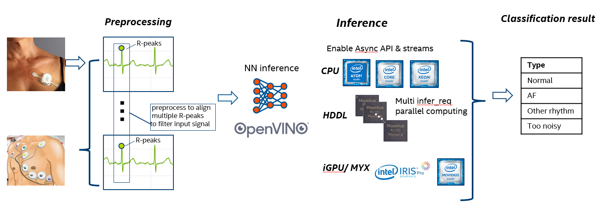

# OpenVINO Common used Model Conversion & Inference 

This repo contains the model conversion and inference steps/samples with Intel® Distribution of OpenVINO™ Toolkit (or [Intel® OpenVINO™](https://01.org/openvinotoolkit)), and those TF/Caffe/MxNet/ONNX models are widely used for Classification, Object Detection, Semantics Segmentation, Speech Recognition, Optical Character Recognition, etc.

You can download [Intel® Distribution of OpenVINO™ Toolkit](https://software.intel.com/en-us/openvino-toolkit) from Intel offical website, or build source code of [Intel® OpenVINO™](https://github.com/opencv/dldt).

To quick ramp-up OpenVINO (including release note, what's new, HW/SW/OS requirement and demo usage), please follow online document: https://docs.openvinotoolkit.org/
To check all OpenVINO 2018 R5 release supported frameworks and supported layers of each framework by following link:
https://docs.openvinotoolkit.org/R5/_docs_MO_DG_prepare_model_Supported_Frameworks_Layers.html

## TensorFlow Model - DeepLabV3+

The DeeplabV3+ model can be refer to https://github.com/tensorflow/models/tree/master/research/deeplab which supports encoder-decoder structure contains atrous spatial pyramid pooling(ASPP) module and Xception Convolution structure. To optimize the inference work with Intel OpenVINO, please use the script to convert TF model with Model Optimizer and use attached python program to do inference.

The Intel OpenVINO probably will do support conversion with the whole model, currently, use model cutting feature to cut pre-processing part of this model. The main workload with MobilenetV2 will be kept for inference. Other operations still implemented by TensorFlow.

#### 1. Model Optimize Commands:
`python mo_tf.py --input_model ./model/DeeplabV3plus_mobileNetV2.pb --input 0:MobilenetV2/Conv/Conv2D --output ArgMax --input_shape [1,513,513,3] --output_dir ./model`

#### 2. Run Inference Engine sample:
`python infer_IE_TF.py -m ./model/DeeplabV3plus_mobileNetV2.xml -i ./test_img/test.jpg -d CPU -l ${INTEL_CVSDK_DIR}/deployment_tools/inference_engine/samples/intel64/Release/lib/libcpu_extension.so`

## ONNX Model - CRNN
This CRNN model can be referred to https://github.com/meijieru/crnn.pytorch, the origin pre-trained model is pytorch (crnn.pth). Current OpenVINO 2018 R5 version still not directly support pyTorch framework, my solution is to convert pyTorch model to ONNX model, then use OpenVINO Model Optimizer to finish IR files generation. 

In this case, I provide sample code for pyTorch2onnx conversion. User can test to download the pytorch model, copy CRNN/pytorch2onnx/convert_pytorch2onnx.py to ./crnn.pytorch. If succefully, you will get crnn.onnx model under the same path. Use the crnn.onnx model as input model for OpenVINO Model Optimizer, set options and flags as the command line in script.sh.

Please pay attension, this demo actually use grayscale image with the size of 100x37 (width x height). Thus, during the model optimizer conversion, please set input shape as [1,1,37,100]. The output layer should be with the name of "234", thus during the inference, please get the result of "234" layer.

## Keras Model - yolov3
This yolov3 model can be referred to https://github.com/Adamdad/keras-YOLOv3-mobilenet. For example, download the darknet53 weights from [YOLO_website](http://pjreddie.com/darknet/yolo/), and convert to keras model by following command:

`python convert.py yolov3.cfg yolov3.weights model_data/yolo.h5`

In this example, we modified the "yolo.py" file to generate Tensorflow model (tf_yolov3_fullx.pb). Then we can use the original test sample to get the tf model:

`python yolo_video.py [OPTIONS...] --image`

While we get the tf model, we can generate to IR by following script in "MO_script.sh" file:

`python /opt/intel/openvino/deployment_tools/model_optimizer/mo_tf.py --input_model ./tf_yolov3_fullx.pb --input input_1,Placeholder_366 --input_shape [1,416,416,3],[1] --freeze_placeholder_with_value "Placeholder_366->0" --tensorflow_use_custom_operations_config ./yolov3_keras.json`

Please note, the configuration file "yolov3_keras.json" specified in MO command for YOLOv3 with custom operation description is differnet from official config file in openvino package. I modified it to match correct input nodes.

Finally, we can check the perf and IE results by attached sample "ie_yolov3.py":

`python ie_yolov3.py --input test.jpg --model ./tf_yolov3_fullx.xml -d CPU -l /opt/intel/openvino/inference_engine/lib/intel64/libcpu_extension_avx2.so`

[ INFO ] Initializing plugin for CPU device...
[ INFO ] Reading IR...
output1: conv2d_59/BiasAdd/YoloRegion
shape: [1, 255, 13, 13]
output2: conv2d_67/BiasAdd/YoloRegion
shape: [1, 255, 26, 26]
output3: conv2d_75/BiasAdd/YoloRegion
shape: [1, 255, 52, 52]
[ INFO ] Loading IR to the plugin...
image ori shape:700,347
image shape:(1, 3, 416, 416)
[Performance] inference time:187.72053718566895 ms
[ INFO ] Layer conv2d_59/BiasAdd/YoloRegion parameters: 
[ INFO ]          classes : 80
[ INFO ]          num     : 3
[ INFO ]          coords  : 4
[ INFO ]          anchors : [116.0, 90.0, 156.0, 198.0, 373.0, 326.0]
[ INFO ] Layer conv2d_67/BiasAdd/YoloRegion parameters: 
[ INFO ]          classes : 80
[ INFO ]          num     : 3
[ INFO ]          coords  : 4
[ INFO ]          anchors : [30.0, 61.0, 62.0, 45.0, 59.0, 119.0]
[ INFO ] Layer conv2d_75/BiasAdd/YoloRegion parameters: 
[ INFO ]          classes : 80
[ INFO ]          num     : 3
[ INFO ]          coords  : 4
[ INFO ]          anchors : [10.0, 13.0, 16.0, 30.0, 33.0, 23.0]
[ INFO ] 
Detected boxes for batch 1:
[ INFO ]  Class ID | Confidence | XMIN | YMIN | XMAX | YMAX | COLOR 
[ INFO ]    dog    |   0.984503 |  167 |  106 |  361 |  308 | (200, 112, 80) 
[ INFO ]    dog    |   0.819315 |   79 |  194 |  165 |  313 | (200, 112, 80)

You can modify the threshold in sample code to get more results with boxes. Please note, above results box location is related on 416x416. 

## OpenVINO demo for healthcare

### AI ECG with Intel OpenVINO for Atrial Fibrillation detection
Case study use [Stanford ML group public ECG model](https://stanfordmlgroup.github.io/projects/ecg2/) with [The Physionet 2017 Challenge dataset](https://www.physionet.org/content/challenge-2017/1.0.0/) for 1D convolutional deep neural network to detect arrhythmias in arbitrary length ECG time-series.

In this case, takes as input the raw ECG data (sampled at 200 Hz), highly optimized NN inference processing with Intel OpenVINO based on x86 platform. To simply demonstrate the low power patient monitor workflow:

+ Intel(R) Core(TM) i7-8700K CPU @ 3.7GHz
+ Ubuntu 16.04.6
+ gcc 5.4.0
