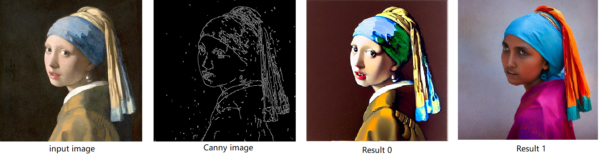
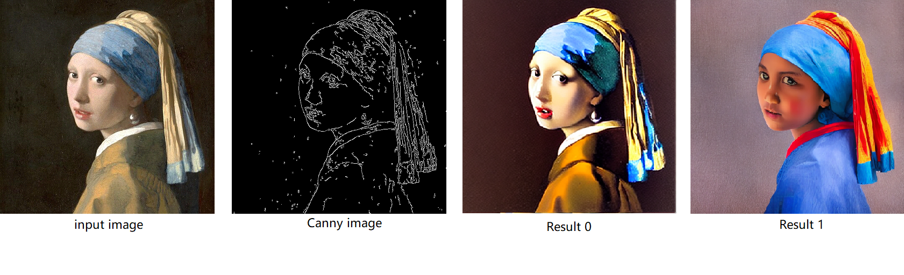
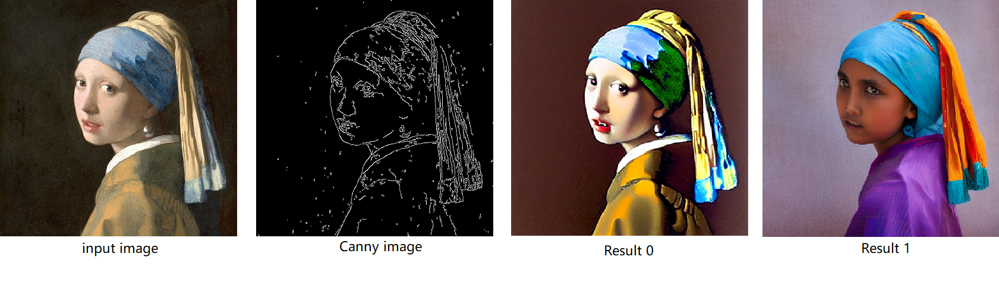

# ControlNet-canny benchmark with Stable Diffusion

## Step 1: Prepare env and download model
```shell
$ mkdir ControlNet && cd ControlNet
$ wget https://huggingface.co/lllyasviel/ControlNet/resolve/main/annotator/ckpts/body_pose_model.pth

$ conda create -n SD python==3.10
$ conda activate SD

$ pip install opencv-contrib-python
$ pip install -q "diffusers>=0.14.0" "git+https://github.com/huggingface/accelerate.git" controlnet-aux gradio
$ pip install openvino openvino-dev onnx
$ pip install torch==1.13.1 #important, must use version<2.0

$ git lfs install
$ git clone https://huggingface.co/lllyasviel/sd-controlnet-canny 
$ git clone https://huggingface.co/runwayml/stable-diffusion-v1-5
$ git clone https://huggingface.co/openai/clip-vit-large-patch14 

$ wget https://huggingface.co/takuma104/controlnet_dev/blob/main/gen_compare/control_images/vermeer_512x512.png 
```

## Step 2: Convert Model to IR
In this case, we generate static model with batch_size=2:
```shell
$ python get_model.py -b 2 -sd stable-diffusion-v1-5/
```
Please check your current path, make sure you already generate below models currently. Other files can be deleted for saving space.
+ controlnet-canny.<xml|bin>
+ text_encoder.<xml|bin>
+ unet_controlnet.<xml|bin>
+ vae_decoder.<xml|bin>

## Step 3: Run test
```shell
$ python run_pipe.py
```
The E2E inference time with 2 prompts(bs=2) on Arc 770 by OV 2023.0.1 is like below:
```shell
...
Inference time(20 its): 6.6 s
```

Now, use below source image to generate image with similar canny.



## Step 4: Enable LoRA weights for Stable Diffusion + ControlNet pipeline (Choose one of below 3 methods)

## Step 4-1: Enable lora by pytorch_lora_weights.bin
This step introduce the method to add lora weights to Stable diffusion Unet model by `pipe.unet.load_attn_procs(...)` function. You can visit https://civitai.com/tag/lora to get lora model. Let's use one lora weights on huggingface as an example:
```shell
$ git clone https://huggingface.co/TheUpperCaseGuy/finetune-lora-stable-diffusion
$ rm unet_controlnet.* unet_controlnet/unet_controlnet.onnx
$ python get_model.py -b 2 -sd stable-diffusion-v1-5/ -lt bin -lw finetune-lora-stable-diffusion/
```
Then, run pipeline inference program to check results.
```shell
$ python run_pipe.py
```
The lora weights appended SD model with controlnet pipeline can generate image like below:



## Step 4-2: Enable lora by safetensors typed weights
This step introduce the method to add lora weights to Stable diffusion Unet model by `diffusers/scripts/convert_lora_safetensor_to_diffusers.py`.
```shell
$ git clone https://huggingface.co/ntc-ai/fluffy-stable-diffusion-1.5-lora-trained-without-data
$ git clone https://github.com/huggingface/diffusers.git && cd diffusers
$ python scripts/convert_lora_safetensor_to_diffusers.py --base_model_path ../stable-diffusion-v1-5/ --checkpoint_path ../fluffy-stable-diffusion-1.5-lora-trained-without-data/fluffySingleWordConcept_v10.safetensors --dump_path ../stable-diffusion-v1-5-fluffy-lora --alpha=1.5
$ cd .. && rm unet_controlnet.* unet_controlnet/unet_controlnet.onnx text_encoder.*
$ python get_model.py -b 2 -sd stable-diffusion-v1-5-fluffy-lora/ -lt safetensors
```
Then, run pipeline inference program to check results.
```shell
$ python run_pipe.py
```
The lora weights appended SD model with controlnet pipeline can generate image like below:



## Step 4-3: Enable runtime lora merging by MatcherPass
This step introduces the method to add lora weights in runtime before unet model compiling. This method is to extract lora weights in safetensors file and find the corresponding weights in unet model and insert weights bias. The common method to add lora weights is:
 `W = W0 + W_bias(alpha * torch.mm(lora_up, lora_down))`.

I intend to insert openvino `opset10.add(W0,W_bias)`. The original attention weights in Unet model is loaded by `Const` op, the common processing path is `Const`->`Convert`->`Matmul`->`...`, if we add the lora weights, we should insert the calculated lora weight bias as `Const`->`Convert`->`Add`->`Matmul`->`...`. In this function, we adopt openvino.runtime.passes.MathcerPass to insert `opset10.add` function.

Please make sure your current unet and text_encoder model is generated from original Stable Diffusion, if you continued from Step 4-2, please do below operations firstly. If you continued from Step 3, you can skip re-generating Unet and text-encoder:
```shell
rm unet_controlnet.* unet_controlnet/unet_controlnet.onnx text_encoder.*
python get_model.py -b 2 -sd stable-diffusion-v1-5/
``` 
Runtime add LoRA weights on original Stable Diffusion with ControlNet pipeline just with 1 step:
```shell
python run_pipe.py -lp fluffy-stable-diffusion-1.5-lora-trained-without-data/fluffySingleWordConcept_v10.safetensors -a 1.5
```
The lora weights appended SD model with controlnet pipeline can generate image like below:


