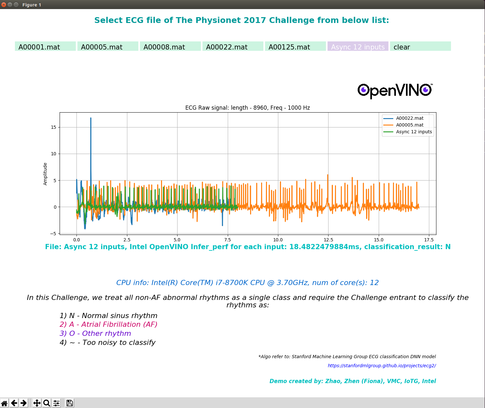

# AI ECG with Intel OpenVINO for Atrial Fibrillation detection

Case study use [Stanford ML group public ECG model](https://stanfordmlgroup.github.io/projects/ecg2/) with [The Physionet 2017 Challenge dataset](https://www.physionet.org/content/challenge-2017/1.0.0/) for 1D convolutional deep neural network to detect arrhythmias in arbitrary length ECG time-series.

In this case, takes as input the raw ECG data (sampled at 200 Hz), highly optimized NN inference processing with Intel OpenVINO based on x86 platform. To simply demonstrate the low power patient monitor workflow:

+ Intel(R) Core(TM) i7-8700K CPU @ 3.7GHz
+ Ubuntu 18.04.4
+ gcc 7.5.0
+ python3.6

## Installation requirements
+ Intel(R) OpenVINO 2020.3
+ pip install numpy
+ pip install scikit-learn
+ pip install scipy
+ pip install matplotlib
+ pip install py-cpuinfo
+ pip install pickle
+ sudo apt install python3-tk

## Setup OpneVINO env
source /opt/intel/openvino/bin/setupvars.sh

## Start AI-ECG demo
python ie_ecg_eval.py -d CPU

## Screenshot

## Description
Click button with file name (e.g A00001.mat), you will get ECG single raw data drawing on the chart, and inference performance and classification result. To refer to a correct result, please check with following table to see acuuracy:

| File name | training reference | TensorFlow result | OpenVINO IE result | OpenVINO IE perf |
| ------ | ------ | ------ | ------ | ------ |
| A00001 | N | N | N | 22.47ms |
| A00005 | A | A | A | 42.26ms |
| A00008 | O | O | O | 42.91ms |
| A00022 | ~ | A | A | 22.82ms |
| A00125 | ~ | O | O | 22.62ms |

Use Async 12 files which inference 12 times parallel on saperate infer requests emulate ECG with 12 leads parallel computing. The Perf of inference A00001.mat with 12 times parallel:

[Performance] each inference time: 18.48 ms which has been optimized 1.22x compare with single inference with A0001
